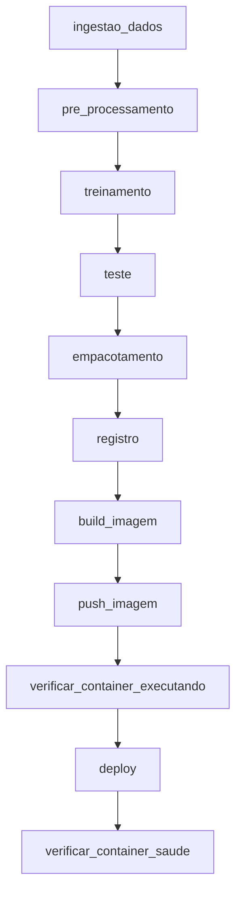

# Resumo das Alterações - dag_entrega_3.py

## Alterações Realizadas

### 1. Imports Adicionados

```python
from airflow.sdk import DAG, task_group
from airflow.hooks.base import BaseHook
from docker import DockerClient as DockerClientAPI
```

### 2. Classe DockerClient

Adicionada a classe `DockerClient` para gerenciar conexões Docker com fallback para unix socket:

```python
class DockerClient(BaseHook):
    '''Docker client that can work with or without Airflow connections'''
    def __init__(self, docker_conn_id: str = None):
        super().__init__()
        self._docker_conn_id = docker_conn_id

    def from_env(self, *args, **kwargs):
        # Tenta obter conexão do Airflow, fallback para unix socket
        ...
```

### 3. Constantes Globais

```python
MLFLOW_CONNECTION_ID = "mlflow"
DOCKER_CONNECTION_ID = "docker"
DOCKERFILE_PATH = "/opt/airflow/dags/api/"
ARTIFACTS_PATH = "/opt/airflow/dags/assets/"
MLFLOW_ADDRESS = "http://mlflow:5000/"
```

### 4. Funções Novas Adicionadas

#### build_imagem(**context)
- Constrói a imagem Docker da API
- Usa o Dockerfile em `/opt/airflow/dags/api/`
- Retorna a tag da imagem

#### push_imagem(**context)
- Envia a imagem para Docker Hub
- Usa credenciais do Airflow Variables
- Valida o push e trata erros

#### verificar_container_executando(**context)
- Verifica se container já existe
- Remove container existente se necessário
- Prepara ambiente para novo deploy

#### deploy(**context)
- Inicia o container Docker
- Monta volume com os artifacts
- Configura variáveis de ambiente
- Expõe porta da API

#### verificar_container_saude(**context)
- Verifica se container está running
- Testa endpoint `/` (root)
- Testa endpoint `/metrics`
- Testa endpoint `/predict` com dados de exemplo
- Armazena resultados no XCom

### 5. Parâmetros do DAG

Adicionados parâmetros configuráveis:

```python
params = {
    'tag_imagem': 'iris-classification-api:latest',
    'nome_container': 'iris-api',
    'porta_api': 8884
}
```

### 6. Novas Tasks

```python
task_build_imagem = PythonOperator(
    task_id="build_imagem",
    python_callable=build_imagem
)

task_push_imagem = PythonOperator(
    task_id="push_imagem",
    python_callable=push_imagem
)

task_verificar_container = PythonOperator(
    task_id="verificar_container_executando",
    python_callable=verificar_container_executando
)

task_deploy = PythonOperator(
    task_id="deploy",
    python_callable=deploy
)

task_verificar_saude = PythonOperator(
    task_id="verificar_container_saude",
    python_callable=verificar_container_saude
)
```

### 7. Dependências Atualizadas

```python
# ML Pipeline
task_ingestao >> task_preprocessamento >> task_treinamento >> task_teste >> task_empacotamento >> task_registro

# Docker Deployment
task_registro >> task_build_imagem >> task_push_imagem >> task_verificar_container >> task_deploy >> task_verificar_saude
```

### 8. Tags Atualizadas

```python
tags=['mlflow', 'iris', 'random-forest', 'onnx', 'docker', 'api']
```

## Fluxo Completo



## Comparação: dag_ci_cd.py vs dag_entrega_3.py

| Aspecto | dag_ci_cd.py | dag_entrega_3.py |
|---------|-------------|------------------|
| **Dataset** | Student Stress | Iris |
| **Modelo** | DecisionTree | RandomForest |
| **Estrutura** | @task decorators + task_group | PythonOperator |
| **Porta API** | 8883 | 8884 |
| **Assets Path** | artifacts/ | assets/ |
| **Health Check** | Não implementado | Completo (3 endpoints) |
| **Parâmetros** | tag_imagem, nome_modelo | tag_imagem, nome_container, porta_api |
| **Volume Mount** | artifacts:artifacts | assets:/app/assets |
| **Env Variables** | Não configuradas | MODEL_PATH, MODEL_METADATA_PATH |

## Requisitos de Configuração

### Airflow Variables Necessárias

```bash
docker_registry_username = <seu_usuario>
docker_registry_password = <sua_senha>
```

### Airflow Connections Necessárias

- **docker**: Conexão Docker (unix socket ou TCP)
- **mlflow**: Conexão MLflow (implícita via URL)

### Estrutura de Arquivos Necessária

```
entrega_03/
├── dags/
│   ├── dag_entrega_3.py
│   ├── api/
│   │   ├── Dockerfile
│   │   └── main.py
│   └── assets/
│       ├── iris_random_forest.onnx        (gerado)
│       ├── model_asset_metadata.json       (gerado)
│       ├── iris_data.pkl                   (gerado)
│       ├── iris_preprocessed.pkl           (gerado)
│       └── random_forest_model.pkl         (gerado)
```

## Testes de Validação

A task `verificar_container_saude` realiza automaticamente:

1. **Container Status Check**
   - Verifica se container está em execução
   - Obtém status e ID do container

2. **Root Endpoint Test**
   - GET http://localhost:8884/
   - Valida resposta JSON com status

3. **Metrics Endpoint Test**
   - GET http://localhost:8884/metrics
   - Valida métricas do modelo
   - Verifica informações do modelo

4. **Prediction Endpoint Test**
   - POST http://localhost:8884/predict
   - Envia dados de exemplo (setosa)
   - Valida resposta de predição

## Como Usar

### Execução Básica

```bash
# Via Airflow UI
1. Acesse o Airflow UI
2. Encontre "relatorio-II"
3. Clique em "Trigger DAG"
4. Execute

# Via CLI
airflow dags trigger relatorio-II
```

### Execução com Parâmetros Customizados

```bash
airflow dags trigger relatorio-II \
  --conf '{
    "tag_imagem": "seunome/iris-api:v1.0",
    "nome_container": "iris-api-prod",
    "porta_api": 8080
  }'
```

### Verificar Container Após Deploy

```bash
# Ver container em execução
docker ps | grep iris-api

# Ver logs do container
docker logs iris-api

# Testar API
curl http://localhost:8884/
curl http://localhost:8884/metrics
curl -X POST http://localhost:8884/predict \
  -H "Content-Type: application/json" \
  -d '{"sepal_length": 5.1, "sepal_width": 3.5, "petal_length": 1.4, "petal_width": 0.2}'
```

## Benefícios da Implementação

1. **CI/CD Completo**: Pipeline end-to-end do treinamento ao deploy
2. **Validação Automática**: Health checks garantem API funcional
3. **Configurável**: Parâmetros flexíveis para diferentes ambientes
4. **Robusto**: Tratamento de erros e rollback automático
5. **Documentado**: Logs detalhados em cada etapa
6. **Testável**: Validação automática de todos os endpoints

## Próximas Melhorias Sugeridas

- [ ] Adicionar monitoramento contínuo (Prometheus/Grafana)
- [ ] Implementar rollback automático em caso de falha
- [ ] Adicionar suporte para blue-green deployment
- [ ] Integrar testes de performance (locust)
- [ ] Adicionar notificações (Slack, email)
- [ ] Implementar versionamento semântico automático
- [ ] Adicionar suporte para múltiplos ambientes (dev, staging, prod)
